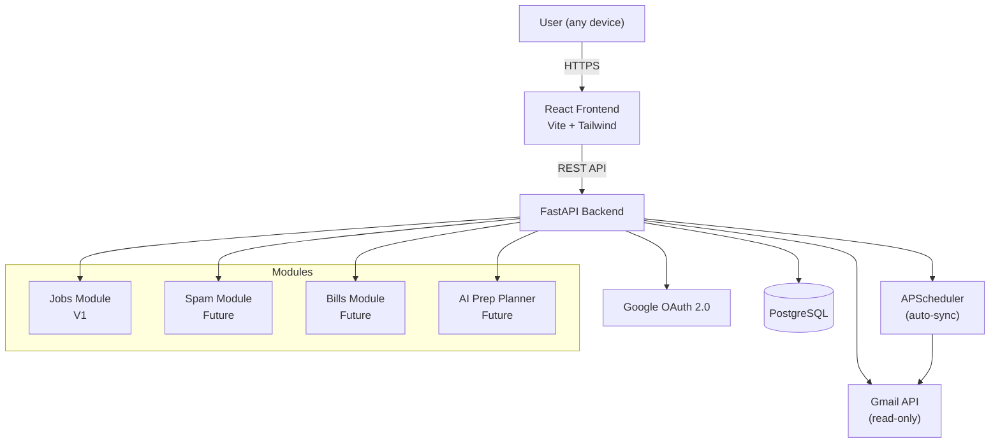

# EmailIQ

A personal email intelligence dashboard that automatically extracts and tracks job applications from Gmail — with a roadmap to cover spam, bills, subscriptions, and AI-powered interview prep.

## What It Is

EmailIQ connects to your Gmail account via Google OAuth and scans your inbox to detect job application emails automatically. It uses a confidence-scoring system (not simple keyword matching) to classify emails accurately, presents them in a clean dashboard, and lets you filter by date range, status, and company. You can confirm or dismiss detections with one click to improve accuracy over time.

Built to be modular — job tracking is V1, but the architecture supports adding spam management, subscription/bill tracking, and an AI interview prep planner on top.

## Problem It Solves

Job seekers applying to dozens of roles struggle to track where they've applied, what stage each application is at, and what needs follow-up. The information already exists in your inbox — confirmation emails, recruiter messages, rejection notices — but it's unstructured and scattered. EmailIQ extracts and organises it automatically so you don't have to maintain a spreadsheet.

## Tech Stack

| Layer | Technology |
|---|---|
| Frontend | React 18, Tailwind CSS, Vite |
| Backend | Python, FastAPI |
| Auth | Google OAuth 2.0 (Authlib) |
| Gmail | Google API Python Client (read-only) |
| Database | PostgreSQL, SQLAlchemy, Alembic |
| Background jobs | APScheduler |
| Future: AI prep planner | Claude API |
| Future: analysis | pandas, plotly |

## Architecture



### Detection — Confidence Scoring

Each email is scored across multiple signals. Emails scoring ≥ 50 are classified as job applications.

| Signal | Score |
|---|---|
| Known ATS sender domain (Greenhouse, Lever, Workday, etc.) | +40 |
| Sender prefix: `careers@`, `recruiting@`, `talent@` | +20 |
| Subject line job keywords | +30 |
| Body job keywords | +15 |
| `no-reply@` prefix | +5 |
| Email in existing classified thread | +25 |

### Data Model (V1)

```
User
 └── ConnectedAccount     ← built for multi-account from day one
      └── EmailRecord
           └── Application
                └── EmailFeedback
```

## Live Demo

> Not deployed yet — in progress.

## How to Run Locally

### Prerequisites
- Python 3.11+
- Node.js 18+
- PostgreSQL
- Google Cloud project with Gmail API enabled and OAuth credentials

### Backend

```bash
cd backend
python -m venv .venv
source .venv/bin/activate  # Windows: .venv\Scripts\activate
pip install -r requirements.txt
cp .env.example .env       # fill in your credentials
alembic upgrade head
uvicorn app.main:app --reload
```

### Frontend

```bash
cd frontend
npm install
cp ../.env.example .env.local  # set VITE_API_URL=http://localhost:8000
npm run dev
```

App runs at `http://localhost:5173`

## Status

**MVP in progress.** V1 scope:
- [x] Project scaffold (FastAPI + React + PostgreSQL)
- [ ] Google OAuth flow
- [ ] Gmail sync (auto + manual)
- [ ] Confidence-scored detection
- [ ] Application dashboard with date range filter
- [ ] User feedback loop (confirm / dismiss)
- [ ] Deployment
