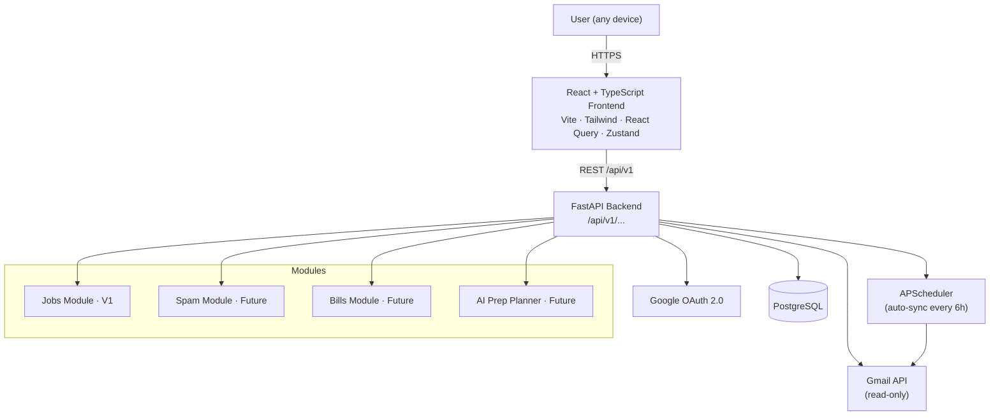
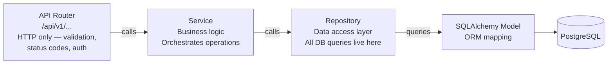
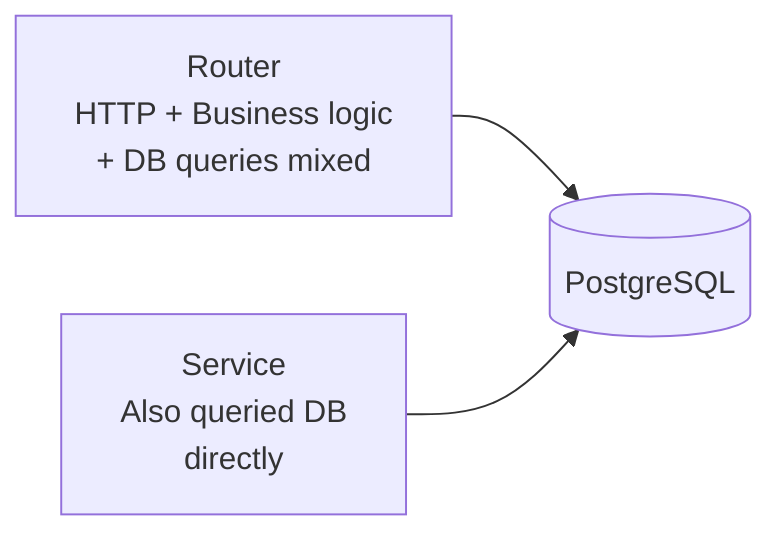
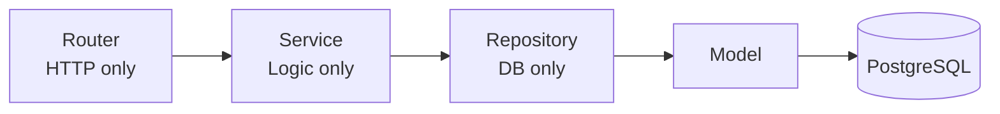

# EmailIQ

A personal email intelligence dashboard that automatically extracts and tracks job applications from Gmail — with a roadmap to cover spam, bills, subscriptions, and AI-powered interview prep.

## What It Is

EmailIQ connects to your Gmail account via Google OAuth and scans your inbox to detect job application emails automatically. It uses a confidence-scoring system (not simple keyword matching) to classify emails accurately, presents them in a clean dashboard, and lets you filter by date range, status, and company. You can confirm or dismiss detections with one click to improve accuracy over time.

Built to be modular — job tracking is V1, but the architecture supports adding spam management, subscription/bill tracking, and an AI interview prep planner on top.

## Problem It Solves

Job seekers applying to dozens of roles struggle to track where they've applied, what stage each application is at, and what needs follow-up. The information already exists in your inbox — confirmation emails, recruiter messages, rejection notices — but it's unstructured and scattered. EmailIQ extracts and organises it automatically so you don't have to maintain a spreadsheet.

## Tech Stack

| Layer | Technology |
|---|---|
| Frontend | React 18, TypeScript, Tailwind CSS, Vite, React Query, Zustand |
| Backend | Python 3.11, FastAPI |
| Auth | Google OAuth 2.0 (Authlib) |
| Gmail | Google API Python Client (read-only scope) |
| Database | PostgreSQL, SQLAlchemy 2.0, Alembic |
| Background jobs | APScheduler |
| Logging | Loguru (structured, JSON in prod) |
| Containerisation | Docker, docker-compose |
| Future: AI prep planner | Claude API |
| Future: analysis | pandas, plotly |

## Architecture

### System Overview



### Backend Layer Architecture

The backend is structured in strict layers — each layer only talks to the one directly below it.



#### Before vs After — Why This Structure

**Before (initial scaffold):** Routes directly ran DB queries and mixed HTTP logic with business logic, making the code hard to test, reuse, or extend.



**After (enterprise layering):** Each concern has exactly one home. Routes are pure HTTP. Services are pure logic. Repositories are the only place that touches the database.



**What this gives you:**
- **Testability** — repositories can be mocked; services unit-tested without a DB
- **Replaceability** — swap PostgreSQL for another DB by rewriting only the repository layer
- **Readability** — every file has a clear, single responsibility
- **Extensibility** — adding a new module (spam, bills) means adding a new repo + service + router, not modifying existing code

### Project Structure

```
emailiq/
├── backend/
│   ├── app/
│   │   ├── api/
│   │   │   └── v1/
│   │   │       ├── router.py          ← aggregates all v1 routes
│   │   │       └── routers/
│   │   │           ├── auth.py        ← HTTP: OAuth flow
│   │   │           ├── applications.py← HTTP: CRUD + feedback
│   │   │           └── sync.py        ← HTTP: trigger sync
│   │   ├── core/
│   │   │   ├── config.py              ← pydantic-settings env config
│   │   │   ├── auth.py                ← JWT + token encryption
│   │   │   ├── exceptions.py          ← domain exception hierarchy
│   │   │   └── logging.py             ← loguru structured logging
│   │   ├── db/
│   │   │   ├── session.py             ← SQLAlchemy engine + get_db
│   │   │   └── base.py                ← DeclarativeBase + model imports
│   │   ├── models/                    ← SQLAlchemy ORM models
│   │   ├── repositories/              ← all DB queries (one class per model)
│   │   │   ├── base.py                ← generic CRUD base repository
│   │   │   ├── user.py
│   │   │   ├── account.py
│   │   │   ├── email_record.py
│   │   │   └── application.py
│   │   ├── schemas/                   ← Pydantic request/response shapes
│   │   ├── services/                  ← business logic only
│   │   │   ├── gmail_service.py       ← Gmail API calls
│   │   │   ├── detection_service.py   ← confidence scoring
│   │   │   └── sync_service.py        ← orchestrates scan + classify
│   │   └── main.py                    ← FastAPI app, middleware, lifespan
│   ├── tests/
│   │   ├── conftest.py                ← test DB, fixtures
│   │   ├── unit/                      ← pure logic tests (no DB)
│   │   └── integration/               ← full request/response tests
│   ├── alembic/                       ← DB migrations
│   ├── pyproject.toml                 ← deps + ruff + mypy config
│   └── Dockerfile
├── frontend/
│   └── src/
│       ├── api/                       ← typed axios wrappers per resource
│       ├── hooks/                     ← React Query hooks
│       ├── pages/                     ← Login, Dashboard, ApplicationDetail
│       ├── store/                     ← Zustand auth store
│       └── types/                     ← shared TypeScript interfaces
├── docker-compose.yml                 ← postgres + backend + frontend
└── .pre-commit-config.yaml            ← ruff lint/format on commit
```

### Detection — Confidence Scoring

Each email is scored across multiple signals. Emails scoring ≥ 50 are classified as job applications.

| Signal | Score |
|---|---|
| Known ATS sender domain (Greenhouse, Lever, Workday, etc.) | +40 |
| Sender prefix: `careers@`, `recruiting@`, `talent@` | +20 |
| Subject line job keywords | +30 |
| Body job keywords | +15 |
| `no-reply@` prefix | +5 |
| Email in existing classified thread | +25 |

### Data Model

```
User
 └── ConnectedAccount     ← built for multi-account from day one
      └── EmailRecord      ← raw Gmail message + confidence score
           ├── Application  ← parsed job application
           └── EmailFeedback← confirm / reject per detection
```

## Live Demo

> Not deployed yet — in progress.

## How to Run Locally

### Option 1 — Docker (recommended)

```bash
cp .env.example .env   # fill in GOOGLE_CLIENT_ID, GOOGLE_CLIENT_SECRET, SECRET_KEY
docker-compose up
```

- API: `http://localhost:8000`
- Frontend: `http://localhost:5173`
- API docs: `http://localhost:8000/api/docs`

### Option 2 — Manual

#### Backend

```bash
cd backend
python -m venv .venv
source .venv/bin/activate   # Windows: .venv\Scripts\activate
pip install -e ".[dev]"
cp .env.example .env        # fill in credentials
alembic upgrade head
uvicorn app.main:app --reload
```

#### Frontend

```bash
cd frontend
npm install
npm run dev
```

## Status

**MVP in progress.** V1 scope:
- [x] Project scaffold — FastAPI + React + TypeScript + PostgreSQL
- [x] Enterprise backend architecture — layered router / service / repository
- [x] Database models (User, ConnectedAccount, EmailRecord, Application, Feedback)
- [x] Confidence-scored email detection engine
- [x] Docker + docker-compose local dev setup
- [x] Structured logging (loguru)
- [x] Test structure (unit + integration)
- [ ] Google OAuth flow (wiring in progress)
- [ ] Gmail sync — auto (APScheduler) + manual trigger
- [ ] Application dashboard UI
- [ ] Deployment
